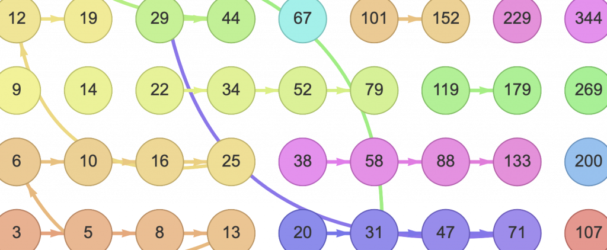

\[WORK IN PROGRESS\]

This treat was inspired by [Jane Street](https://www.janestreet.com/)'s puzzle: [Traversing the Infinite Sidewalk](https://www.janestreet.com/numberphile/). See also the [On-Line Encyclopedia of Integer Sequences](https://oeis.org/wiki/Welcome):

- [OEIS sequence A358838](https://oeis.org/A358838): Minimum number of jumps needed to go from slab 0 to slab n in Jane Street's infinite sidewalk,

- [OEIS sequence A359005](https://oeis.org/A359005): Jane Street's infinite sidewalk's greedy walk,

- [OEIS sequence A359008](https://oeis.org/A359008): Jane Street's infinite sidewalk's greedy walk inverse mapping.

Jane owns a special rosary. It has a single end and is comprised of an infinite number of black and white beads. Starting from the end, the beads are numbered $n = 0, 1, 2,\\ldots$ and each has a label $L(n) = 1, 1, 2, 2, 3, 3,\\ldots$ Every third bead including the zeroth one is black; the other beads are white.

\[auto-iframe link="https://douzebis.github.io/jane-s-rosary/rosary.html?n=10" width="100%" height=60 autosize=no\]

Figure 1: Jane's rosary (beads numbers are shown)

\[auto-iframe link="https://douzebis.github.io/jane-s-rosary/rosary-labels.html?n=10" width="100%" height=60 autosize=no\]

Figure 2: Jane's rosary (beads labels are shown)

Jane tells the beads of her rosary in a special way. She always starts at bead zero. Then each time she is done with a bead (say bead $n$), she moves on, either _up_ to bead $n + L(n)$ or _down_ to bead $n - L(n)$.

\[auto-iframe link="https://douzebis.github.io/jane-s-rosary/telling-the-rosary.html?n=10" width="100%" height=180 autosize=no\]

Figure 3: Telling the beads of Jane's rosary

Can Jane tell every bead in her rosary? (That is the question.)

\[lwptoc\]

## Prelude: names

> To weave the magic of a thing, you see, one must find its true name out.
> 
> Ursula K. Le Guin, A Wizard of Earthsea

- **Bead**: a natural number $n \\in \\mathbb{N}$

- **Black bead**: a bead $n$ such that $3$ divides $n$ - denoted $3 \\mid n$

- **White bead**: a bead $n$ such that $3$ does not divide $n$ - denoted $3 \\not\\mid n$

- **Even bead**: a bead $n$ that is even - denoted $2 \\mid n$

- **Odd bead**: a bead $n$ that is odd - denoted $2 \\not\\mid n$

- **Label**: the label of bead $n$ is $L(n) = 1 + \\lfloor {n \\over 2}\\rfloor$

- **Up**: going _up_ from bead $n$, Jane reaches bead $U(n)$ also denoted by $n\\cdot U()$ (object-oriented notation). $$U: \\mathbb{N}\\rightarrow\\mathbb{N}, n\\mapsto\\lfloor {3n\\over2}\\rfloor + 1$$

- **Down**: going _down_ from bead $n>0$, Jane reaches bead $D(n)$ also denoted by $n\\cdot D()$ (object-oriented notation). $$D: \\mathbb{N}\\rightarrow\\mathbb{N}, n\\mapsto\\lceil {n\\over2}\\rceil - 1$$

- **Lambda**: when possible, Jane reaching bead $n$ while moving _up_, can only happen from bead $\\lambda(n)$ also denoted by $n\\cdot\\lambda()$ (object-oriented notation). $$\\lambda: \\mathbb{N}\\setminus3\\mathbb{N}\\rightarrow\\mathbb{N}, n\\mapsto\\lfloor{2n\\over3}\\rfloor$$ $$\\forall n\\in\\mathbb{N}\\setminus3\\mathbb{N}, n = n\\cdot\\lambda()\\cdot U()$$

- **Mu**: given any $n$, there is always a unique way for Jane to reach bead $n$ while moving _down_ from an odd bead, which we call $\\mu(n)$ also denoted by $n\\cdot\\mu()$ (object-oriented notation). $$\\mu:\\mathbb{N}\\rightarrow\\mathbb{N}, n\\mapsto2n+1$$ $$\\forall n\\in\\mathbb{N}, n = n\\cdot\\mu()\\cdot D()$$

- **Nu**: given any $n$, there is always a unique way for Jane to reach bead $n$ while moving _down_ from an even bead, which we call $\\nu(n)$ also denoted by $n\\cdot\\nu()$ (object-oriented notation). $$\\nu:\\mathbb{N}\\rightarrow\\mathbb{N}, n\\mapsto2n+2$$ $$\\forall n\\in\\mathbb{N}, n = n\\cdot\\nu()\\cdot D()$$

- **Recitation**: starting at bead $n$ and randomly moving _up_ or _down_ finitely or infinitely many times, Janes performs a recitation. In other words a recitation is a sequence $\\big(a\_n\\big)$ of natural numbers such that $a\_0 = n$ and $a\_{i+1} = a\_i\\cdot U()$ or $a\_{i+1} = a\_i\\cdot D()$

- **Length**: the length of a recitation is the number of moves it comprises, finite or infinite.

- **Minimal recitation**: a recitation from bead $n$ to bead $m$, with minimal length. By convention, a minimal recitation to bead $m$ (mention of $n$ omitted) is a minimal recitation from bead $0$ to bead $m$.

- **Height**: the height of bead $n$ is the length for a minimal recitation from bead $0$ to $n$. Every bead has a unique finite height, as we are about to see.

Note that interpreted as functions, _up_, _lambda_, _mu_ and _nu_ are strictly increasing. _Down_ is an increasing function.

## The height of a bead

It is obvious that $\\mbox{height}(0) = 0$.

What about the height of bean $n$ in general?

\[auto-iframe link="https://douzebis.github.io/jane-s-rosary/the-height-of.html?n=3" width="100%" height=180 autosize=no\]

Figure 4: The height of bead $3$ is $5$ (beads labels are shown)

Given $n>0$, observe that:

- $3\\not\\mid n \\implies n=m.U()$, where $m = n\\cdot\\lambda()$,

- $3\\mid n \\land 9\\not\\mid n \\implies n=m\\cdot U()\\cdot U()\\cdot D()$, where $m = n\\cdot\\mu()\\cdot\\lambda()\\cdot\\lambda() = \\lfloor{8n\\over9}\\rfloor$,

- $9\\mid n \\implies n=m\\cdot U()\\cdot U()\\cdot D()$, where $m = n\\cdot\\nu()\\cdot\\lambda()\\cdot\\lambda() = \\lfloor{8n+6\\over9}\\rfloor$.

This shows (by induction) that every bead has a finite height. $\\quad\\Box$

This also gives two upper bounds:

\\begin{align}  
\\mbox{for all }n,\\;\\mbox{height}(n) \\leq 1+{4n\\over3}\\\\  
\\mbox{for all }n>0,\\;\\mbox{height}(n) \\leq 6{log(n)\\over log(9/8)}  
\\end{align}

The logarithmic bound was suggested by [Jianing Song](https://oeis.org/wiki/User:Jianing_Song).

### Computing the height of a bead

The following simple exploration-based algorithm will do:

def height(n: int) -> int:
    import itertools
    if n < 0: raise Exception("n must be a nonnegative integer")
    if n == 0: return 0
    if n == 1: return 1
    visited = {0, 1}  # the beads we have visited so far
    rings = \[{0}, {1}\]  # the beads grouped by height
    for h in itertools.count(2):
        new\_ring = set()
        for bead in rings\[h - 1\]:
            label = (bead >> 1) + 1
            for next\_bead in {bead - label, bead + label}:
                if not next\_bead in visited:
                    if next\_bead == n: return h
                    visited.add(next\_bead)
                    new\_ring.add(next\_bead)
        rings.append(new\_ring)

## About minimal recitations

In this section, we use $M$ to denote either $U$ or $D$.

### Minimal recitations ending in a white bead

The following property holds for any white bead $\\langle n\\rangle$\[efn\_note\]For more clarity, we will sometimes decorate white beads as $\\langle3n+1\\rangle$ and black beads as $\[3n\]$.\[/efn\_note\]: there always exist a minimal recitation from $0$ to $\\langle n\\rangle$ that **ends in _up_**. In other words, for all $n\\in\\mathbb{N}$:

\\begin{align}  
&3\\not\\mid n \\implies\\label{EndsInUp}\\\\  
&\\qquad\\exists M\_i,\\;n=0\\cdot M\_0()\\cdot M\_1()\\dots\\cdot U() \\mbox{ is a minimal recitation}\\nonumber  
\\end{align}

The proof is by induction and by contradiction. Assume $h\\in\\mathbb{N}$ given, and assume that for each white bead $n$ of height $<h$, property ($\\ref{EndsInUp}$) holds.

Further assume (by contradiction) $n$ of height $h$ such that no minimal recitation from $0$ to $n$ ends in _up_. Finally, consider a minimal recitation $\\cal{R}$ from $0$ to $n$ (thus necessarily ending in _down_).

Obviously, $n$ is of the form $\\langle3k+1\\rangle$ or $\\langle3k+2\\rangle$ for some $k\\ge0$.

Let's first deal with the case If $n = \\langle3k+1\\rangle$. Observe the three following commutating diagrams:

diagram $n\\cdot\\mu()\\cdot\\mu()$:  
\\begin{CD}  
8k+4 @<\\lambda<< \\langle 12k+7\\rangle\\\\  
@VVDV @AA\\mu A\\\\  
4k+1 @. (6k+3)\\\\  
@VVDV @AA\\mu A\\\\  
2k @>U>> {\\langle 3k+1\\rangle}  
\\end{CD}

diagram $n\\cdot\\mu()\\cdot\\nu()$:  
\\begin{CD}  
8k+5 @<\\lambda<< \\langle 12k+8\\rangle\\\\  
@VVDV @AA\\nu A\\\\  
4k+2 @. (6k+3)\\\\  
@VVDV @AA\\mu A\\\\  
2k @>U>> {\\langle 3k+1\\rangle}  
\\end{CD}

diagram $n\\cdot\\nu()$:  
\\begin{CD}  
4k+2 @<\\lambda<< \\langle6k+4\\rangle\\\\  
@VVDV @AA\\nu A\\\\  
2k @>U>> {\\langle 3k+1\\rangle}  
\\end{CD}

$\\cal{R}$ must correspond to one of the above diagrams. There are three possibilities:

- Minimal recitation ending in $n\\cdot\\mu()\\cdot\\mu()$: since $\\langle12k+7\\rangle$ is a white bead of height $h-2$, it must have a minimal recitation ending in _up_. Which produces a minimal recitation for $\\langle n\\rangle$, ending in _down_\-_down_\-_up_.

- Minimal recitation ending in $n\\cdot\\mu()\\cdot\\nu()$: since $\\langle12k+8\\rangle$ is a white bead of height $h-2$, it must have a minimal recitation ending in _up_. Which produces another minimal recitation for $\\langle n\\rangle$, ending in _down_\-_down_\-_up_.

- Minimal recitation ending in $n\\cdot\\nu()$: since $\\langle6k+4\\rangle$ is a white bead of height $h-1$, it must have a minimal recitation ending in _up_. Which produces another minimal recitation for $\\langle n\\rangle$, ending in _down_\-_up_.
    

Each time there is a contradiction because a minimal recitation is produced, which is ending in _up_.

Dealing next with the case $n = \\langle3k+2\\rangle$ brings the same conclusion. The corresponding commutating diagrams are as follows:

diagram $n\\cdot\\mu()\\cdot\\mu()$:  
\\begin{CD}  
8k+8 @<\\lambda<< \\langle 12k+13\\rangle\\\\  
@VVDV @AA\\mu A\\\\  
4k+3 @. (6k+6)\\\\  
@VVDV @AA\\nu A\\\\  
2k+1 @>U>> {\\langle 3k+2\\rangle}  
\\end{CD}

diagram $n\\cdot\\mu()\\cdot\\nu()$:  
\\begin{CD}  
8k+9 @<\\lambda<< \\langle 12k+14\\rangle\\\\  
@VVDV @AA\\nu A\\\\  
4k+4 @. (6k+6)\\\\  
@VVDV @AA\\mu A\\\\  
2k+1 @>U>> {\\langle 3k+2\\rangle}  
\\end{CD}

diagram $n\\cdot\\nu()$:  
\\begin{CD}  
4k+3 @<\\lambda<< \\langle6k+5\\rangle\\\\  
@VVDV @AA\\mu A\\\\  
2k+1 @>U>> {\\langle 3k+2\\rangle}  
\\end{CD}

In all cases, we have a contradiction. This shows that property ($\\ref{EndsInUp}$) holds for all white bead $\\langle n\\rangle$. $\\quad\\Box$

### Minimal recitations ending in a black bead

An immediate consequence of property ($\\ref{EndsInUp}$) is that the following property holds for any black bead $\[n\]>0$: there always exist a minimal recitation from $0$ to $\[n\]$ that **ends in _up_\-_down_**. In other words, for all $n\\in\\mathbb{N}, n>0$:

\\begin{align}  
&3\\mid \[n\]\\land \[n\]\\neq0\\implies\\label{EndsInUpDown}\\\\  
&\\qquad\\exists M\_i,\\;\[n\]=0\\cdot M\_0()\\cdot M\_1()\\dots\\cdot U()\\cdot D() \\mbox{ is a minimal recitation}\\nonumber  
\\end{align}

The proof uses the following two diagrams. $\\quad\\Box$

\\begin{CD}  
4k @<\\lambda<< \\langle 6k+1\\rangle\\\\  
@. @AA\\mu A\\\\  
{} @. (3k)\\\\  
\\end{CD}

\\begin{CD}  
4k+1 @<\\lambda<< \\langle 6k+2\\rangle\\\\  
@. @AA\\nu A\\\\  
{} @. (3k)\\\\  
\\end{CD}

## Interlude: more names

> Hey, Louie. The man is dry. Give him one on the house, okay?
> 
> Ridley Scott, Blade Runner (1982)

- **Eager recitation**: an infinite recitation that only moves _up_.

- **Maximal eager recitation**: an eager recitation that starts at a black bead. Every bead belongs to a unique maximal eager recitation. The maximal eager recitations form a partition of Jane's rosary.

- **Seed**: the seed of bead $n$ - denoted by $\\sigma(n)$ is the starting bead of the maximal eager recitation that visits $n$. Seeds are well defined and black.

- **Lambex**: the lambex of bead $n$ - denoted by $\\Lambda(n)$ - is the position of $n$ in the maximal eager recitation it belongs to. In other words: $\\sigma(n) = n\\big(\\cdot \\lambda()\\big)^{\\Lambda(n)}$

- **Jane's reluctant recitation**: Jane starts the reluctant recitation at bead $0$ and always moves _down_ rather than _up_. But the rule is that Jane must never visit a bead more than once.

- **Rho**: $\\rho(n)$ is the $n$th bead in Jane's reluctant recitation. For instance, $\\rho(0) = 0$, $\\rho(5) = 3$, $\\rho(13) = 12$. See [figure 9](#figure-9).

Note that _rho_ (by construction) is an injective function.

## The structure of Jane's rosary

The partitioning of Jane's rosary in maximal eager recitations produces an original one-to-one mapping $\\gamma$ between $\\mathbb{N}$ and $\\mathbb{N}\\times\\mathbb{N}$:

$$\\gamma(n) \\stackrel{def}{=} \\Big({\\sigma(n)\\over3}, \\Lambda(n)\\Big)$$

This mapping is illustrated by Figure 5.

<iframe src="https://douzebis.github.io/jane-s-rosary/reluctant-chant.html?n=all&amp;width=9&amp;height=9&amp;labels=position&amp;arrows=none&amp;colors=none" width="632" height="632" style="border:none;" scrolling="no"></iframe>

Figure 5: Jane's rosary deconstructed (beads grouped by maximal eager recitation)

With this mapping, the beads' heights have a clean representation:

<iframe src="https://douzebis.github.io/jane-s-rosary/reluctant-chant.html?n=all&amp;width=9&amp;height=9&amp;labels=height&amp;arrows=height&amp;colors=height" width="632" height="632" style="border:none;" scrolling="no"></iframe>

Figure 6: Jane's rosary deconstructed (beads' heights are shown)

## Conjecture 1

Let $\[n\]>0$ be a black bead ($3\\mid n$).

\\begin{align}  
\\Lambda(\\mu(\[n\])) \\neq \\Lambda(\\nu(\[n\]))  
\\end{align}

\\begin{align}  
&\\mbox{The following property holds:}\\label{EndsInDown}  
\\end{align}

- If $\\Lambda(\\mu(\[n\]))>\\Lambda(\\nu(\[n\]))$, then there exist a minimal recitation from $0$ to $\[n\]$, ending in $\[n\] = \\sigma(\\mu(\[n\]))\\big(\\cdot U()\\big)^{\\Lambda(\\mu(n))}\\cdot D()$.

- If $\\Lambda(\\nu(\[n\]))>\\Lambda(\\mu(\[n\]))$, then there exist a minimal recitation from $0$ to $\[n\]$, ending in $\[n\] = \\sigma\[\\nu(\[n\]))\\big(\\cdot U()\\big)^{\\Lambda(\\nu(n))}\\cdot D()$.

In other words, it is $\\mu(\[n\])$ or $\\nu(\[n\])$ which correctly points to the origin of a minimal recitation from $0$ to $n$, depending on which of $\\mu(\[n\])$ or $\\nu(\[n\])$ has the larger lambex.

This is illustrated in [figure 7](#figure-7): the solid arrows point to the origin of minimal recitations; at black beads, the dashed arrows correspond to the discarded option.

<iframe src="https://douzebis.github.io/jane-s-rosary/reluctant-chant.html?n=all&amp;width=9&amp;height=9&amp;labels=position&amp;arrows=back&amp;colors=none" width="632" height="632" style="border:none;" scrolling="no"></iframe>

Figure 7: when in doubt, the right backtrack is farther to the right

An immediate consequence of ($\\ref{EndsInDown}$) is that there is a minimal recitation ending in $\[n\]$ with _up_\-_up_\-_down_:

\\begin{align}  
&3\\mid \[n\]\\land \[n\]\\neq0\\implies\\label{EndsInUpUpDown}\\\\  
&\\qquad\\exists M\_i,\\;\[n\]=0\\cdot M\_0()\\dots U()\\cdot U()\\cdot D() \\mbox{ is a minimal recitation}\\nonumber  
\\end{align}

Also:

\\begin{align}  
\\Lambda(\\mu(\[n\])) > \\Lambda(\\nu(\[n\])) \\iff \\sigma(\\mu(\[n\])) < \\sigma(\\nu(\[n\]))  
\\end{align}

I cannot prove conjecture ($\\ref{EndsInUp}$). However I was able to verify with a computer that it is true until at least $n = 1000000$ ($10^6$).

### Better computing the height of a bead

Provided conjecture ($\\ref{EndsInUp}$) holds, the following algorithm will compute $\\mbox{height}(n)$ with complexity $\\mbox{log(n)}$ in time and contant in space:

def turbo\_height(n: int) -> int:
    import itertools
    if n < 0: raise Exception("n must be a nonnegative integer")
    n2 = n
    h = 0
    while True:
        if n == 0: return h
        if n%3 != 0:
            n = (2\*n)//3
            if n2%3 == 0:
                n2 = n
            else:
                n2 = (2\*n2)//3
        elif n2%3 != 0:
            n2 = (2\*n2)//3
            n = n2
        else:
            n2 = 2\*n + 2
            n = 2\*n + 1
        h += 1

## Jane's reluctant recitation

The reluctant recitation was suggested by [Neal Gersh Tolunsky](https://oeis.org/wiki/User:Neal_Gersh_Tolunsky). The recitation starts at bead $\[0\]$ and Jane tells the beads, always preferring to move _down_ rather than _up_ - hence the name. But the rule is that Jane never visits a bead more than once.

The following two figures illustrate the moves of the reluctant recitation.

<iframe src="https://douzebis.github.io/jane-s-rosary/reluctant-chant.html?n=all&amp;width=9&amp;height=9&amp;labels=reluctant&amp;arrows=naked&amp;colors=reluctant" width="632" height="632" style="border:none;" scrolling="no"></iframe>

Figure 8: Jane's performing the reluctant recitation

<iframe src="https://douzebis.github.io/jane-s-rosary/reluctant-chant.html?n=all&amp;width=9&amp;height=9&amp;labels=position&amp;arrows=numbered&amp;colors=reluctant" width="632" height="632" style="border:none;" scrolling="no"></iframe>

Figure 9: Jane's performing the reluctant recitation (beads numbers are shown)

## Jane's reluctant recitation is infinite

A careful observation shows that while performing the reluctant recitation, Jane's neatly visit the maximal eager recitations from left to right, without ever creating gaps. This ensures that the reluctant recitation process never blocks.

<iframe src="https://douzebis.github.io/jane-s-rosary/reluctant-chant.html?n=31&amp;width=9&amp;height=9&amp;labels=position&amp;arrows=numbered&amp;colors=reluctant" width="632" height="632" style="border:none;" scrolling="no"></iframe>

Figure 10: Jane's reluctant recitation process never stops

The proof is by induction and by contradiction. Let's assume Jane's reluctant recitation process generates gaps along the way, and let $\\rho(n)$ be the first bead that generates a gap. Looking at [figure 10](#figure-10), we see that $n>30$.

Since obviously an _up_ move cannot create a gap in a maximal eager recitation, it holds that $\\rho(n) = \\rho(n-1)\\cdot D()$.

Since a gap $g$ was created, $\\rho(n)$ must be a white bead, and $g = \\lambda(\\rho(n))$.

The contradiction will appear when we consider $\\rho(n-2)$, and there are two cases: $\\rho(n) = 3k+1$ and $\\rho(n) = 3k+2$.

### First case: $\\rho(n) = 3k + 1$

Let's assume $\\rho(n) = 3k+1$.

If $\\rho(n-1) = \\rho(n)\\cdot \\nu()$, then one of the two following commutative diagrams holds:

\\begin{CD}  
\\bbox\[17pt\]{ }\\\\  
{\\boxtimes\_2: 4k+2} @<\\lambda<< {\\boxtimes\_1: \\langle6k+4\\rangle}\\\\  
@VVDV @AA\\nu A\\\\  
{\\Box: g=2k} @>U>> {\\boxtimes\_0: \\langle 3k+1\\rangle}  
\\end{CD}

\\begin{CD}  
{} @. {\\boxtimes\_2}\\\\  
@. @VVDV\\\\  
{\\boxtimes\_i: 4k+2} @>U>> {\\boxtimes\_1: \\langle6k+4\\rangle}\\\\  
@VVDV @AA\\nu A\\\\  
{\\Box: g=2k} @>U>> {\\boxtimes\_0: \\langle 3k+1\\rangle}  
\\end{CD}

On the left hand side diagram, there is a contradiction since after $\\boxtimes\_2$ Jane would have moved _down_ to $g=\\Box$, rather than _up_ to $\\boxtimes\_1$.

On the right hand side diagram, $\\boxtimes\_i$ must have been visited earlier, since $\\boxtimes\_1$ has not created a gap (induction hypothesis), so there is also a contradiction, since $\\boxtimes\_i$ should have moved _down_ to $\\Box$.

Consequently $\\rho(n-1) = \\rho(n)\\cdot \\nu() = 6k+3$ is a black bead, and we have two subcases to investigate: $\\rho(n-2) = \\rho(n-1)\\cdot \\mu()$ and $\\rho(n-2) = \\rho(n-1)\\cdot nu()$

#### First subcase: $\\rho(n-2) = \\mu(\\rho(n-1))$

If $\\rho(n-2) = \\rho(n-1)\\cdot \\mu()$, then one of the two following commutative diagrams holds:

\\begin{CD}  
\\bbox\[17pt\]{ }\\\\  
{\\boxtimes\_4: 8k+5} @<<\\lambda< {\\boxtimes\_2: \\langle12k+7\\rangle}\\\\  
@VVDV @AA\\mu A\\\\  
{\\boxtimes\_i: 4k+2} @. {\\boxtimes\_1: (6k+3)}\\\\  
@VVDV @AA\\mu A\\\\  
{\\Box: g=2k} @>U>> {\\boxtimes\_0: \\langle 3k+1\\rangle}  
\\end{CD}

\\begin{CD}  
{} @. {\\boxtimes\_3}\\\\  
@. @VVDV\\\\  
{\\boxtimes\_i: 8k+4} @>>U> {\\boxtimes\_2: \\langle12k+7\\rangle}\\\\  
@VVDV @AA\\mu A\\\\  
{\\boxtimes\_{i-1}: 4k+2} @. {\\boxtimes\_1: (6k+3)}\\\\  
@VVDV @AA\\mu A\\\\  
{\\Box: g=2k} @>U>> {\\boxtimes\_0: \\langle 3k+1\\rangle}  
\\end{CD}

On the left hand side diagram, $\\boxtimes\_i$ must have been visited earlier, since Jane chose to move _up_ to $\\boxtimes\_2$ after $\\boxtimes\_3$. There is a contradiction since after $\\boxtimes\_i$ Jane would have moved _down_ to $g=\\Box$.

On the right hand side diagram, $\\boxtimes\_i$ must have been visited earlier, since $\\boxtimes\_2$ has not created a gap (induction hypothesis). After $\\boxtimes\_i$ Jane must have moved _down_ to $\\boxtimes\_{i-1}$ and from there she would have moved _down_ to $\\Box$, again a contradiction.

#### Second subcase: $\\rho(n-2) = \\nu(\\rho(n-1))$

If $\\rho(n-2) = \\rho(n-1)\\cdot nu()$, then one of the two following commutative diagrams holds:

\\begin{CD}  
\\bbox\[17pt\]{ }\\\\  
{\\boxtimes\_3: 8k+5} @<<\\lambda< {\\boxtimes\_2: \\langle12k+8\\rangle}\\\\  
@VVDV @AA\\nu A\\\\  
{\\boxtimes\_i: 4k+2} @. {\\boxtimes\_1: (6k+3)}\\\\  
@VVDV @AA\\mu A\\\\  
{\\Box: g=2k} @>U>> {\\boxtimes\_0: \\langle 3k+1\\rangle}  
\\end{CD}

\\begin{CD}  
{} @. {\\boxtimes\_3}\\\\  
@. @VVDV\\\\  
{\\boxtimes\_i: 8k+5} @>>U> {\\boxtimes\_2: \\langle12k+8\\rangle}\\\\  
@VVDV @AA\\nu A\\\\  
{\\boxtimes\_{i-1}: 4k+2} @. {\\boxtimes\_1: (6k+3)}\\\\  
@VVDV @AA\\mu A\\\\  
{\\Box: g=2k} @>U>> {\\boxtimes\_0: \\langle 3k+1\\rangle}  
\\end{CD}

On the left hand side diagram, $\\boxtimes\_i$ must have been visited earlier, since Jane chose to move _up_ to $\\boxtimes\_2$ after $\\boxtimes\_3$. There is a contradiction since after $\\boxtimes\_i$ Jane would have moved _down_ to $g=\\Box$.

On the right hand side diagram, $\\boxtimes\_i$ must have been visited earlier, since $\\boxtimes\_2$ has not created a gap (induction hypothesis). After $\\boxtimes\_i$ Jane must have moved _down_ to $\\boxtimes\_{i-1}$ and from there she would have moved _down_ to $\\Box$, again a contradiction.

At this point, we conclude that it is not possible that $\\rho(n) = 3k+1$.

### Second case: $\\rho(n) = 3k + 2$

Let's assume $\\rho(n) = 3k+2$.

The way to find the contradiction is the same as above.

If $\\rho(n-1) = \\rho(n)\\cdot \\mu()$, the commutative diagrams to consider are:

\\begin{CD}  
\\bbox\[17pt\]{ }\\\\  
{\\boxtimes\_2: 4k+3} @<\\lambda<< {\\boxtimes\_1: \\langle6k+5\\rangle}\\\\  
@VVDV @AA\\mu A\\\\  
{\\Box: g=2k+1} @>U>> {\\boxtimes\_0: \\langle 3k+2\\rangle}  
\\end{CD}

\\begin{CD}  
{} @. {\\boxtimes\_2}\\\\  
@. @VVDV\\\\  
{\\boxtimes\_i: 4k+3} @>U>> {\\boxtimes\_1: \\langle6k+5\\rangle}\\\\  
@VVDV @AA\\mu A\\\\  
{\\Box: g=2k+1} @>U>> {\\boxtimes\_0: \\langle 3k+2\\rangle}  
\\end{CD}

If $\\rho(n-1) = \\rho(n)\\cdot \\nu()$ and $\\rho(n-2) = \\rho(n-1)\\cdot \\mu()$, the commutative diagrams to consider are:

\\begin{CD}  
\\bbox\[17pt\]{ }\\\\  
{\\boxtimes\_3: 8k+8} @<<\\lambda< {\\boxtimes\_2: \\langle12k+13\\rangle}\\\\  
@VVDV @AA\\mu A\\\\  
{\\boxtimes\_i: 4k+3} @. {\\boxtimes\_1: (6k+6)}\\\\  
@VVDV @AA\\nu A\\\\  
{\\Box: g=2k+1} @>U>> {\\boxtimes\_0: \\langle 3k+2\\rangle}  
\\end{CD}

\\begin{CD}  
{} @. {\\boxtimes\_3}\\\\  
@. @VVDV\\\\  
{\\boxtimes\_i: 8k+8} @>>U> {\\boxtimes\_2: \\langle12k+13\\rangle}\\\\  
@VVDV @AA\\mu A\\\\  
{\\boxtimes\_{i-1}: 4k+3} @. {\\boxtimes\_1: (6k+6)}\\\\  
@VVDV @AA\\nu A\\\\  
{\\Box: g=2k+1} @>U>> {\\boxtimes\_0: \\langle 3k+2\\rangle}  
\\end{CD}

If $\\rho(n-1) = \\rho(n)\\cdot \\nu()$ and $\\rho(n-2) = \\rho(n-1)\\cdot \\nu()$, the commutative diagrams to consider are:

\\begin{CD}  
\\bbox\[17pt\]{ }\\\\  
{\\boxtimes\_3: 8k+9} @<<\\lambda< {\\boxtimes\_2: \\langle12k+14\\rangle}\\\\  
@VVDV @AA\\nu A\\\\  
{\\boxtimes\_i: 4k+4} @. {\\boxtimes\_1: (6k+6)}\\\\  
@VVDV @AA\\nu A\\\\  
{\\Box: g=2k+1} @>U>> {\\boxtimes\_0: \\langle 3k+2\\rangle}  
\\end{CD}

\\begin{CD}  
{} @. {\\boxtimes\_3}\\\\  
@. @VVDV\\\\  
{\\boxtimes\_i: 8k+9} @>>U> {\\boxtimes\_2: \\langle12k+14\\rangle}\\\\  
@VVDV @AA\\nu A\\\\  
{\\boxtimes\_{i-1}: 4k+4} @. {\\boxtimes\_1: (6k+6)}\\\\  
@VVDV @AA\\nu A\\\\  
{\\Box: g=2k+1} @>U>> {\\boxtimes\_0: \\langle 3k+2\\rangle}  
\\end{CD}

This concludes the proof that Jane's reluctant recitation process never blocks. $\\quad\\Box$

## Conjecture 2

We have demonstrated (just above) that Jane's reluctant recitation is a well defined infinite sequence $\\Big(\\rho(n)\\Big)$ of natural numbers. By construction $\\rho$ is injective, but more than that,

\\begin{align}  
\\mbox{it seems that } \\rho \\mbox { is a permutation of } \\mathbb{N}.\\label{ReluctantPermutation}  
\\end{align}

I cannot prove conjecture ($\\ref{ReluctantPermutation}$). However I was able to verify with a computer that $\\rho$ reaches every integer up to $7884654$ ($\\approx 7.8\\cdot10^6$).

## Conjecture 3

As a side curiosity, it seems that:

\\begin{align}  
\\mbox{for all } n>0,\\quad \\sigma(3n-1) < 2n\\\\  
\\mbox{for all } n>0,\\quad \\sigma(3n+1) \\leq 2n  
\\end{align}

I was able to verify with a computer that this is true for all $n$ up to $10000000$ ($= 10^7$).

<iframe src="https://douzebis.github.io/jane-s-rosary/reluctant-chant.html?n=all&amp;width=9&amp;height=9&amp;labels=position&amp;arrows=sigma&amp;colors=none" width="632" height="632" style="border:none;" scrolling="no"></iframe>

Figure 11: neighbours of black beads have lower seeds

## Jane's foraging sequence

\[WORK IN PROGRESS\]

1/ Dans le chant réticent, on remplace chaque perle noire n par l'entier seed(n), et on supprime les répétitions directes. On appelle la suite obtenue la suite tergiversante {dithering(n)} -- tergiversante parce qu'elle n'arrive pas à se fixer et revient à l'infini sur chaque perle noire.  
Démontré :  
  - la suite tergiversante est bien définie est est infinie  
Conjecture :  
  - pour tous entiers n et i donnés, il existe un j > i tel que dithering(j) == 3n

2/ Si on ne s'intéresse qu'aux perles noires.  
On numérote les perles noires -- i.e., la n-ième perle correspond à l'entier 3n dans le chapelet de Jane.  
On définit les opérations Mu et Nu (avec majuscule) sur les perles :  
  - Mu(n) = root(mu(3n)) / 3  
  - Nu(n) = root(nu(3n)) / 3  
Mu et Nu sont des opérations sur les perles noires.  
On définit Height(n) (avec majuscule) la hauteur de la n-ième perle :  
  - Depth(n) est la longueur minimale d'un chemin de n à 0 par les opérations Mu et Nu.

Questions :  
  - Quelles sont les propriétés du graphe orienté reliant les perles noires par les opérations Mu et Nu ?  
  - Peut-on encadrer Height(n) par une formule ?  
  - Un algorithme efficace pour calculer Height(n) ?  
  - Peut-on définir un équivalent du chant réticent pour les perles noires ?
